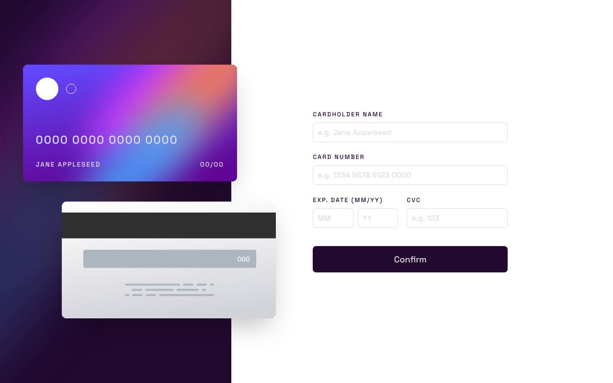

<h1 align="center">
    An interactive credit card form
</h1>

  
   
  
   
    

    <a href="https://interactive-card-details-form-liard.vercel.app/" target="_blank">Click here to see the live demo!</a>&nbsp;&nbsp;&nbsp;

## :rocket: User stories
- User can add card data into the form;
- User can see the data update in the cards;
- User can see the form confirmation;

## :rocket: Technologies

- [ReactJS](https://reactjs.org/)
- [ViteJS](https://vitejs.dev/)
- [TypeScript](https://www.typescriptlang.org/)
- [Styled Components](https://styled-components.com/)
- [Animate.css](https://animate.css/)

Made with ♥ by Carlos :wave: [Get in touch!](https://www.linkedin.com/in/kdumagalhaes/)
